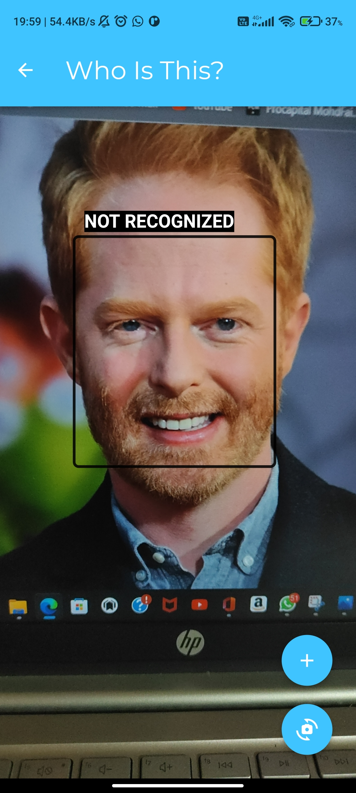
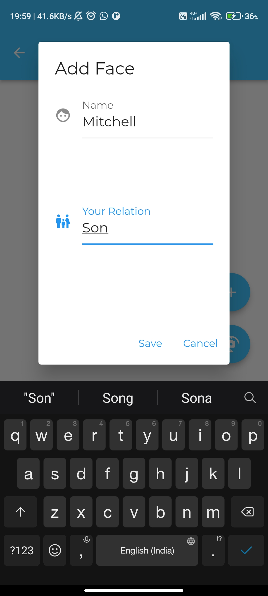
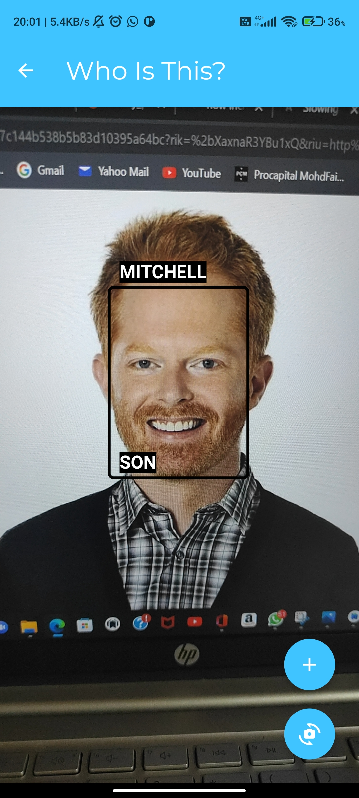
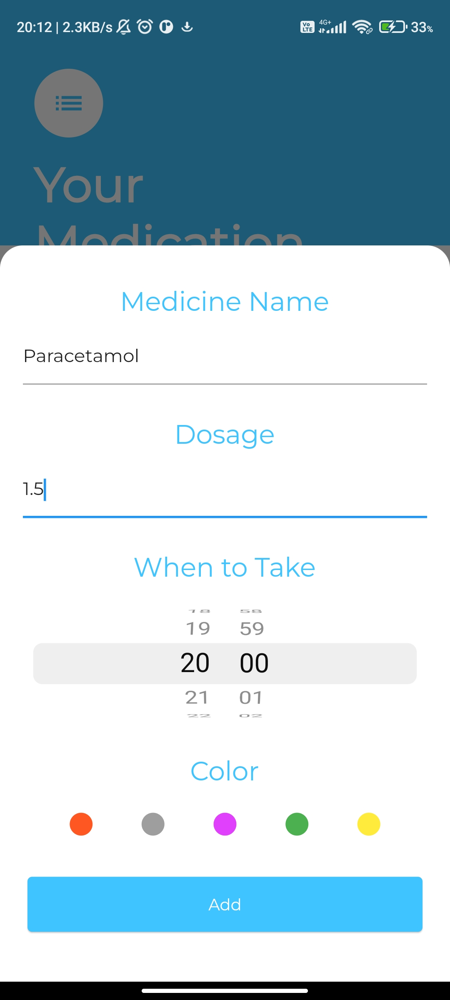
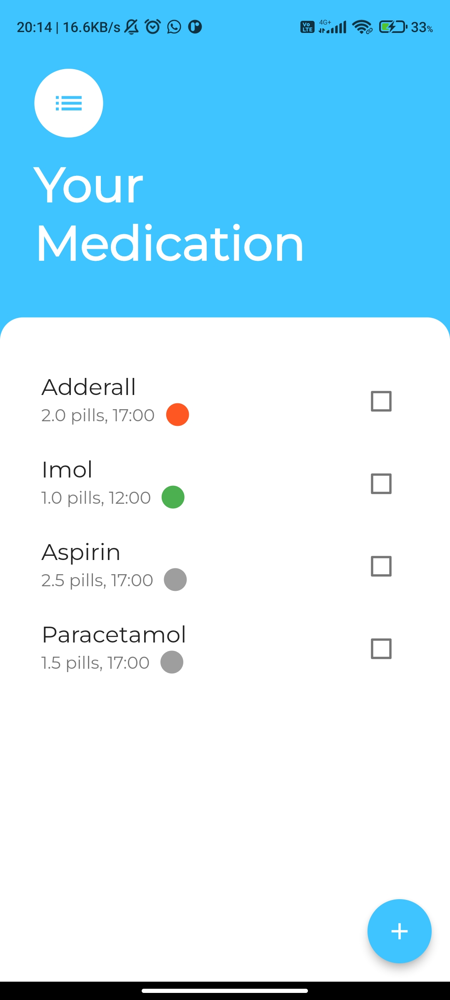
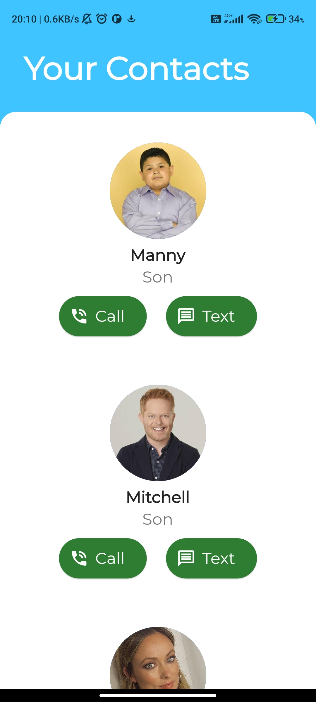
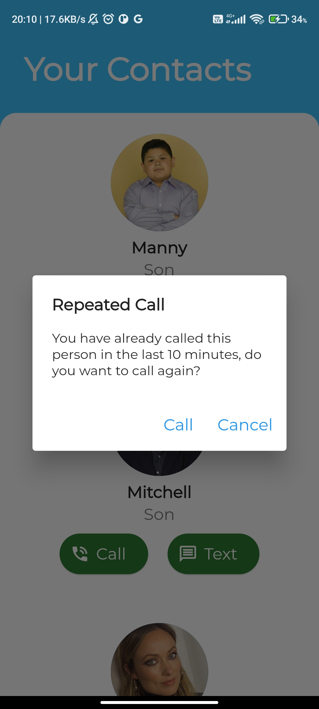

# Carely

#### An real-time face recognition app developed to aid patients with early stage dementia for the NetApp WIN 2022.
---
## Key Features
---
- Recognize and identify friends and family in real-time
- Add new faces via image or in real-time
- Set reminders for medication
- Get an alert for repeated calls ( an extra feature, since people with dementia tend to forget they've already made a call and proceed to call the person repeatedly )
## Steps for face recognition
---
### Face detection
- Google ML Kit

### Face Recognition
- Convert Tensorflow implementation of MobileFaceNet model to Tflite
---
## Face-recognition in real time
  
---
## Set reminders for medication
  
---
## Get an alert for repeated calls
  

---
## Model used - FaceNet
- Accuracy - 98.57
- Precision - 100
- Recall - 97.14
- F1 Score - 98.55
---
## What's Next?
- Add a feature to mark contacts as favourites and display them on top.
- Add multi-language support to increase accessibility.
- Understand patient requirements and take feedback.
